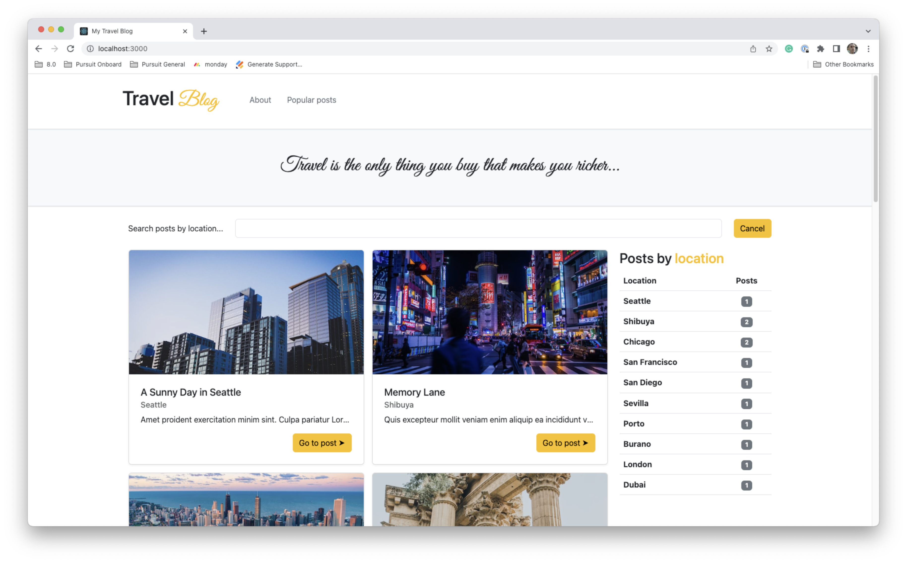
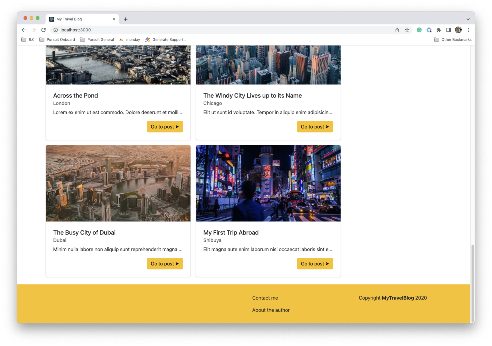
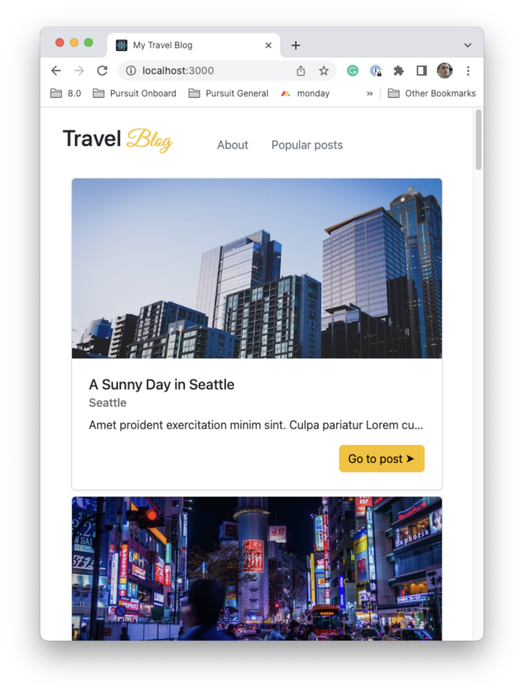
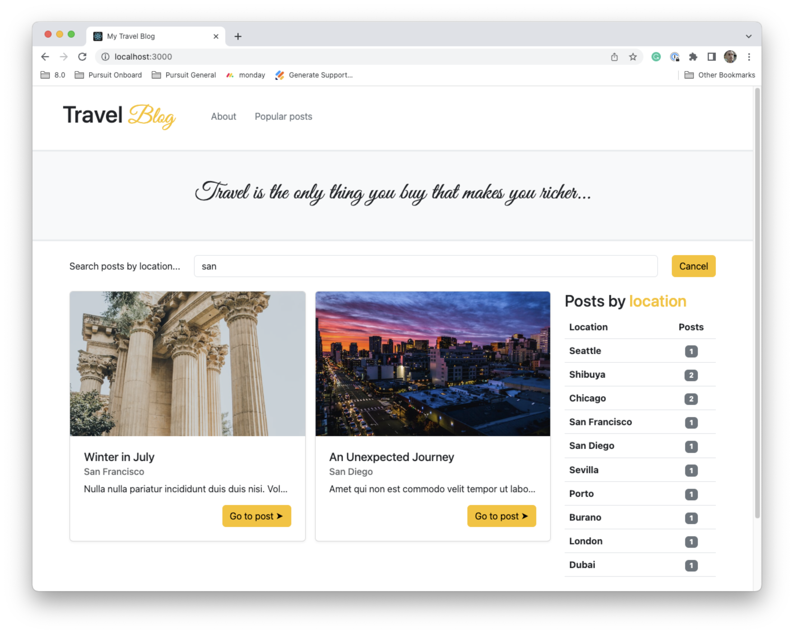
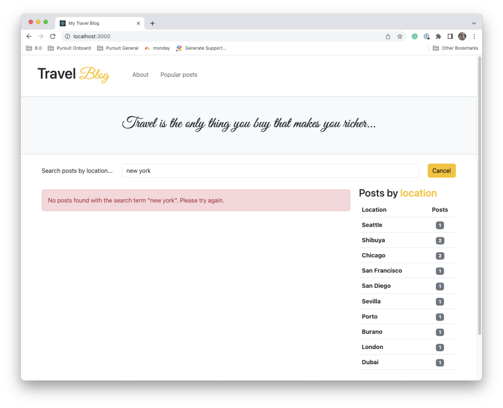

# Bootstrap CSS Lab

Bootstrap is a powerful CSS framework used on [many well-known websites](https://w3techs.com/technologies/overview/css_framework). When working on the job, typically, there is a separate design team that will design the look and feel of the website. They will create mockups with other tools and your job will be to make a functional website matching their designs as accurately as possible. In this lab, you have been given the designs and you will utilize Bootstrap to design the front-page of a travel blog with two differently styled views: desktop and mobile.

You will need to leverage your skills with React and Bootstrap to complete this lab.

## Getting started

1. Fork and clone this repository.

1. Navigate to the cloned repository's directory on your command line. Then, run the following command:

   ```
   npm install
   ```

1. Open up the repository in VSCode. Follow the instructions below to complete the Lab.

## Application structure

This application contains a few files of which you should be aware.

- `public/index.html`: The Bootstrap CSS CDN is already included in this file. You _should not_ need to make any changes.

- `src/App.js`: This is the entry file into your React application. You should begin building and importing your components here.

- `src/index.css`: This file imports a [Google Font](https://fonts.google.com/) that you will use as part of designing your application. You can apply the font using the `.script-font` class, also included in this file. Finally, another class will help you to set the size of certain images.

- `src/data/posts.json`: This JSON file contains data for the posts. You will use this data to populate your page.

- `src/images`: This folder contains images to use in tandem with the `posts.json` file. The `index.js` file in here is optional to use, but can make it easier to export the images.

## Instructions

To complete this lab, you will need to complete the following steps. You have the following goals with this lab:

- You should create a website that looks _as similar as possible_ to the screenshots below by structuring HTML elements and adding appropriate Bootstrap classes.

- You should not need to add any custom CSS. You also should not need to edit the `posts.json` file in any way.

- Your website should function as described below.

### Main view

The main view looks like so:



You will notice the following at the top of the page:

- A logo, created with text, and two links in the navigation bar.

- A designed quote is at the top of the page.

- A search bar that allows for searching by post title and location.

- A series of posts. These posts include the post title, the location, and an abbreviated version of the post content. Finally, a button is at the bottom.

- A table on the right-side of the page. This table shows a count of all posts by location.

At the bottom of the page is a footer.



The footer includes two links, "Contact me" and "About the author". On the far right it includes some text.

### Mobile view

On smaller screen sizes, the view changes.



You'll notice the following changes on the mobile view:

- The quote and search bar are hidden.

- As opposed to a 2x2 grid for the posts, the posts all stack on top of one another.

At the bottom of the page on mobile, you should find the table and footer.


### Search

When text is inputted into the search bar, the posts displayed on the page should immediately filter depending on the text input. If the inputted text matches with either the title or location, that post should show. Otherwise, it should be hidden. The search should be _case-insensitive._



If there are no matches for the search terms, an alert should be shown. The alert should include the text that is in the search bar.



#### Image credits

The following photos were used from Unsplash.

- <a href="https://unsplash.com/es/@peterlaster?utm_source=unsplash&utm_medium=referral&utm_content=creditCopyText">Pedro Lastra</a> on <a href="https://unsplash.com/wallpapers/travel/city?utm_source=unsplash&utm_medium=referral&utm_content=creditCopyText">Unsplash</a>
- <a href="https://unsplash.com/ko/@koukichi_t?utm_source=unsplash&utm_medium=referral&utm_content=creditCopyText">Koukichi Takahashi</a> on <a href="https://unsplash.com/wallpapers/travel/city?utm_source=unsplash&utm_medium=referral&utm_content=creditCopyText">Unsplash</a>
- <a href="https://unsplash.com/@tompodmore86?utm_source=unsplash&utm_medium=referral&utm_content=creditCopyText">Tom Podmore</a> on <a href="https://unsplash.com/wallpapers/travel/city?utm_source=unsplash&utm_medium=referral&utm_content=creditCopyText">Unsplash</a>
- <a href="https://unsplash.com/@linglivestolaugh?utm_source=unsplash&utm_medium=referral&utm_content=creditCopyText">Ling Tang</a> on <a href="https://unsplash.com/wallpapers/travel/city?utm_source=unsplash&utm_medium=referral&utm_content=creditCopyText">Unsplash</a>
- <a href="https://unsplash.com/@tompodmore86?utm_source=unsplash&utm_medium=referral&utm_content=creditCopyText">Tom Podmore</a> on <a href="https://unsplash.com/wallpapers/travel/city?utm_source=unsplash&utm_medium=referral&utm_content=creditCopyText">Unsplash</a>
- <a href="https://unsplash.com/@tompodmore86?utm_source=unsplash&utm_medium=referral&utm_content=creditCopyText">Tom Podmore</a> on <a href="https://unsplash.com/wallpapers/travel/city?utm_source=unsplash&utm_medium=referral&utm_content=creditCopyText">Unsplash</a>
- <a href="https://unsplash.com/@jdent?utm_source=unsplash&utm_medium=referral&utm_content=creditCopyText">Jason Dent</a> on <a href="https://unsplash.com/wallpapers/travel/city?utm_source=unsplash&utm_medium=referral&utm_content=creditCopyText">Unsplash</a>
- <a href="https://unsplash.com/@derekstory?utm_source=unsplash&utm_medium=referral&utm_content=creditCopyText">Derek Story</a> on <a href="https://unsplash.com/wallpapers/travel/city?utm_source=unsplash&utm_medium=referral&utm_content=creditCopyText">Unsplash</a>
- <a href="https://unsplash.com/@squarelab?utm_source=unsplash&utm_medium=referral&utm_content=creditCopyText">Square Lab</a> on <a href="https://unsplash.com/wallpapers/travel/city?utm_source=unsplash&utm_medium=referral&utm_content=creditCopyText">Unsplash</a>
- <a href="https://unsplash.com/@andresgarcia?utm_source=unsplash&utm_medium=referral&utm_content=creditCopyText">Andres Garcia</a> on <a href="https://unsplash.com/wallpapers/travel/city?utm_source=unsplash&utm_medium=referral&utm_content=creditCopyText">Unsplash</a>
